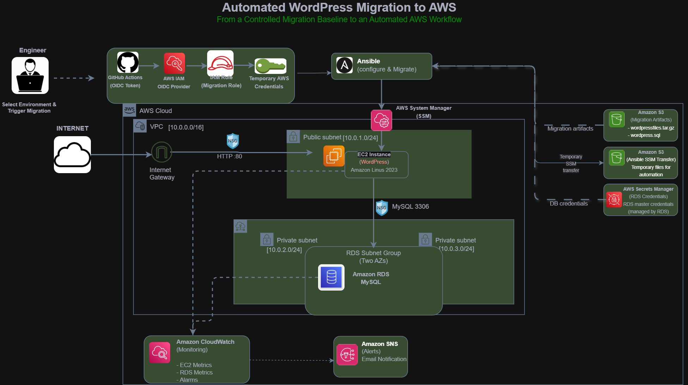
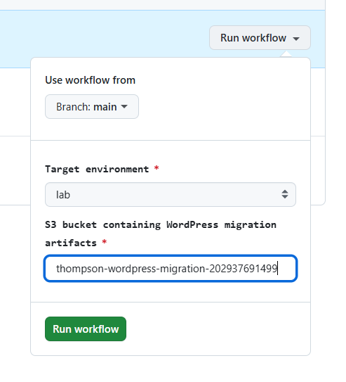
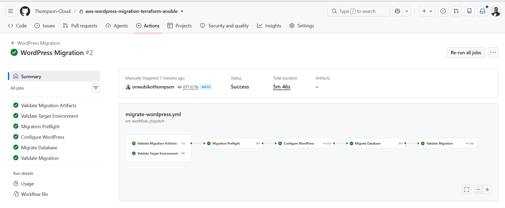
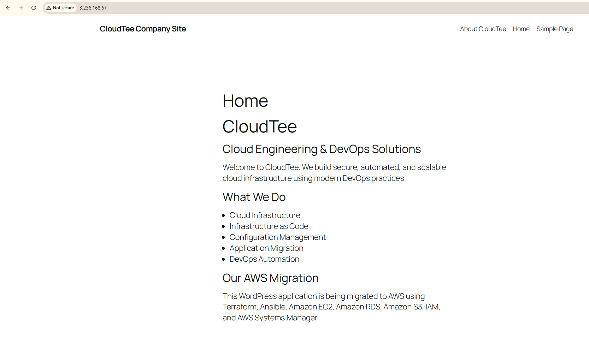

# Automated WordPress Migration to AWS

An automated workflow for migrating an existing **WordPress application and MySQL database to AWS** using **Terraform, Ansible, GitHub Actions, AWS Systems Manager, Amazon RDS, Amazon S3, AWS Secrets Manager, and GitHub OIDC**.

The project focuses on one operational problem: **reducing the manual coordination required to execute a familiar migration process reliably.**

The migration was developed in two stages:

- **V1 — Migration Baseline:** Established the AWS migration path using Terraform and Ansible.
- **V2 — Migration Orchestration:** Removed the remaining manual coordination using GitHub Actions, OIDC, dynamic AWS resource discovery, and automated validation.

> **The engineer controls the intent. The automation handles the execution.**

---

## Architecture



*Figure 1 — GitHub Actions orchestrates the migration, Ansible performs configuration and migration through Systems Manager, and Terraform manages the AWS infrastructure lifecycle.*

- **Terraform** — provisions AWS infrastructure
- **Ansible** — configures EC2 and performs the WordPress/MySQL migration
- **GitHub Actions** — orchestrates migration stages
- **AWS Systems Manager** — provides connectivity without inbound SSH
- **GitHub OIDC** — provides temporary AWS credentials
- **Amazon S3** — stores migration artifacts
- **AWS Secrets Manager** — provides RDS credentials
- **CloudWatch + SNS** — provide monitoring and notifications

Terraform remains outside the migration workflow, separating **infrastructure lifecycle from workload migration**.

---

## Migration Workflow

The migration is initiated manually using `workflow_dispatch`. The engineer selects the target environment and provides the S3 bucket containing the migration artifacts.



*Figure 2 — The engineer provides migration intent; the workflow handles target discovery and execution.*

```text
Validate Artifacts ──┐
                     ├──► Preflight ► Configure ► Migrate ► Validate
Validate Target ─────┘
```

Each stage gates the next. A failed validation, target check, or migration step prevents later stages from continuing.

---

## Dynamic Target Discovery

The workflow discovers AWS resources using tags rather than hardcoded EC2 instance IDs or RDS endpoints.

```text
Project     = aws-wordpress-migration
Environment = lab
Role        = wordpress-app / wordpress-db
```

The engineer provides:

```text
Environment      = lab
Migration bucket = <S3 migration-artifact bucket>
```

The automation discovers the corresponding infrastructure.

RDS discovery expects exactly one matching database and fails when the target is missing or ambiguous.

---

## Key Engineering Decisions

| Decision | Reason |
|---|---|
| Terraform outside the migration workflow | Separates infrastructure lifecycle from workload migration |
| Ansible through Systems Manager | Provides configuration automation without inbound SSH or SSH key management |
| Private RDS | Prevents direct public database exposure |
| GitHub OIDC | Avoids long-lived AWS credentials in GitHub |
| Tag-based discovery | Removes dependency on temporary AWS resource IDs |
| Secrets Manager | Keeps database credentials out of code |
| `workflow_dispatch` | Keeps migration an intentional operational event |
| Strict RDS discovery | Fails safely on missing or ambiguous targets |

---

## Results

The final **CloudTee** migration reused the same automated workflow without changes to the migration orchestration, demonstrating that the workflow was not tied to the earlier application content.

All six stages completed successfully:

```text
✓ Validate Migration Artifacts
✓ Validate Target Environment
✓ Migration Preflight
✓ Configure WordPress
✓ Migrate Database
✓ Validate Migration
```

### Automated Migration Pipeline



*Figure 3 — Final migration run completed successfully in 5m 37s.*

### Migrated WordPress Application



*Figure 4 — CloudTee running on AWS after the automated WordPress and MySQL migration.*

Migration success was validated at three levels:

```text
Pipeline
   +
AWS Infrastructure
   +
Application
   =
Migration Success
```

Validation confirmed that:

- EC2 was running and accessible through Systems Manager
- RDS was available, encrypted, and not publicly accessible
- WordPress configuration and database migration completed successfully
- Migrated database content was present
- The CloudTee application loaded successfully
- CloudWatch monitoring was configured

---

## Security Highlights

- Private Amazon RDS database
- RDS encryption at rest
- Encrypted EC2 root storage
- IMDSv2 enforcement
- No inbound SSH administration
- Security-group-to-security-group MySQL access
- S3 encryption and public-access blocking
- Database credentials managed through Secrets Manager
- GitHub OIDC instead of long-lived AWS access keys
- IAM-based access control

---

## Repository Structure

```text
.
├── .github/
│   └── workflows/
│       └── migrate-wordpress.yml
├── ansible/
│   ├── group_vars/
│   ├── inventory/
│   ├── playbooks/
│   └── tasks/
├── docs/
│   └── images/
├── scripts/
│   └── validate-artifacts.sh
├── terraform/
│   ├── bootstrap/
│   ├── github-oidc/
│   └── infrastructure/
├── .gitignore
└── README.md
```

Migration artifacts (`wordpress-files.tar.gz` and `wordpress.sql`) are kept outside Git and uploaded to the private migration S3 bucket when required.

---

## Scope

This project focuses on the **migration and automation workflow**, not on designing a complete production WordPress hosting platform.

The lab uses a cost-conscious Single-AZ database and direct HTTP access to EC2 for application validation. Production requirements such as HTTPS, load balancing, high availability, scaling, backup/recovery, DNS cutover, and formal rollback procedures would be evaluated separately based on workload requirements.

---

## Documentation

### Engineering Case Study

The full engineering story covers the transition from manually coordinated migration to automation, architectural decisions, OIDC troubleshooting, validation strategy, and engineering trade-offs.

**[Read the engineering case study on Medium](https://medium.com/@thompson.onwubiko.dev/from-manual-migration-to-automation-automating-wordpress-migration-to-aws-ae748ecdd89f)**


---

## Outcome

The project transformed a familiar migration process from manually coordinated execution into a repeatable workflow:

**dynamic resource discovery → temporary authentication → controlled sequencing → automated migration → end-to-end validation**

The engineer controls what environment to migrate into and when to start.

> **The automation handles the repetitive execution required to complete it reliably.**
